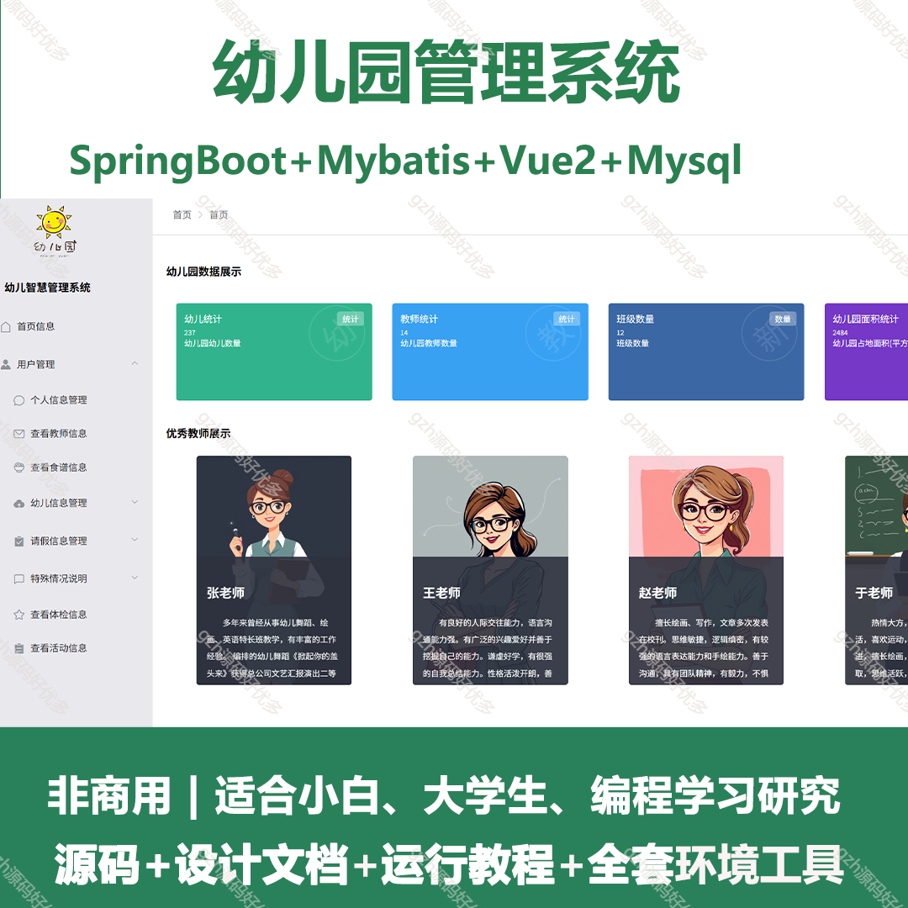
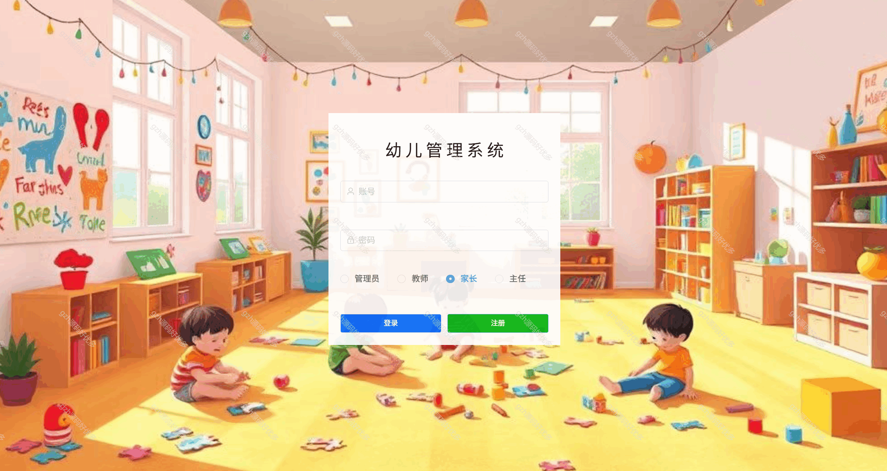
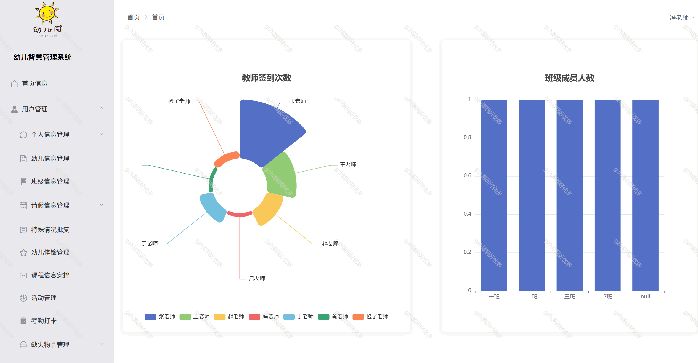
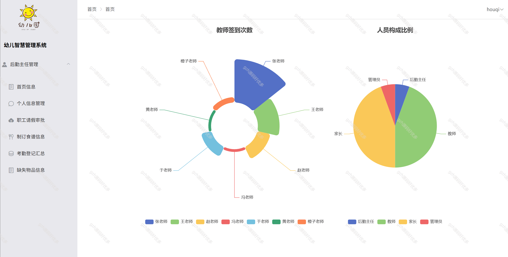
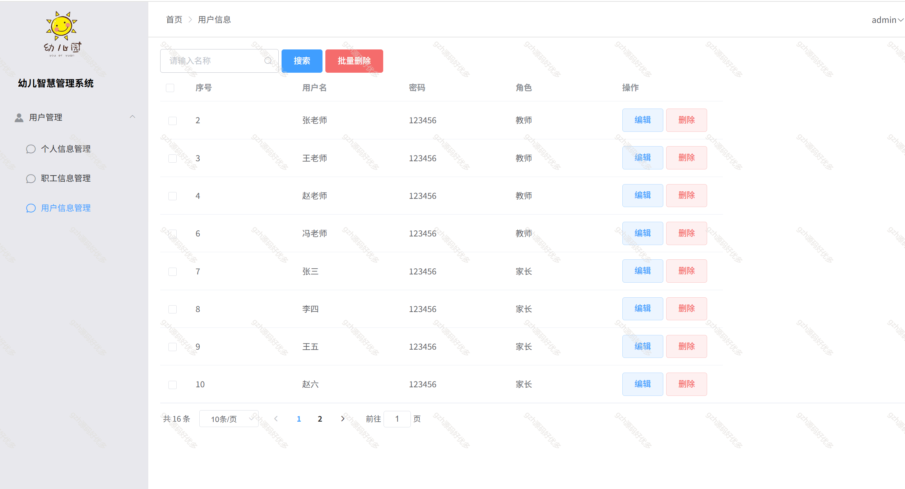
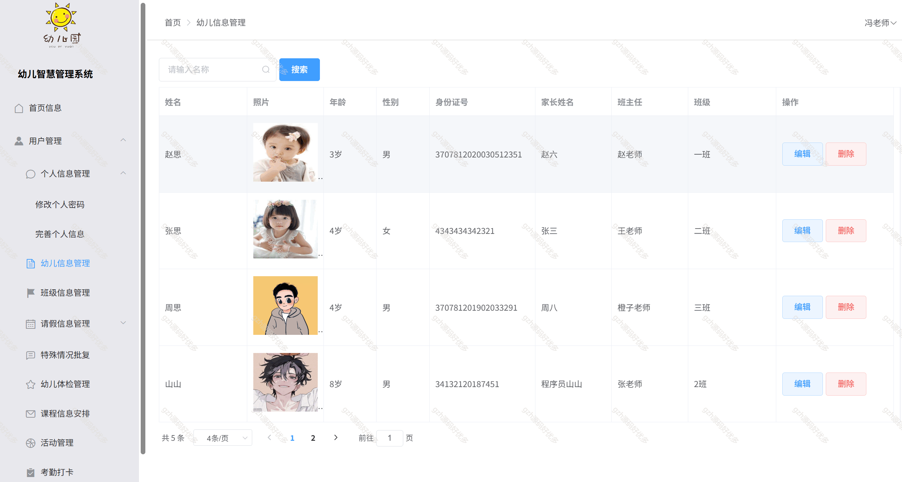
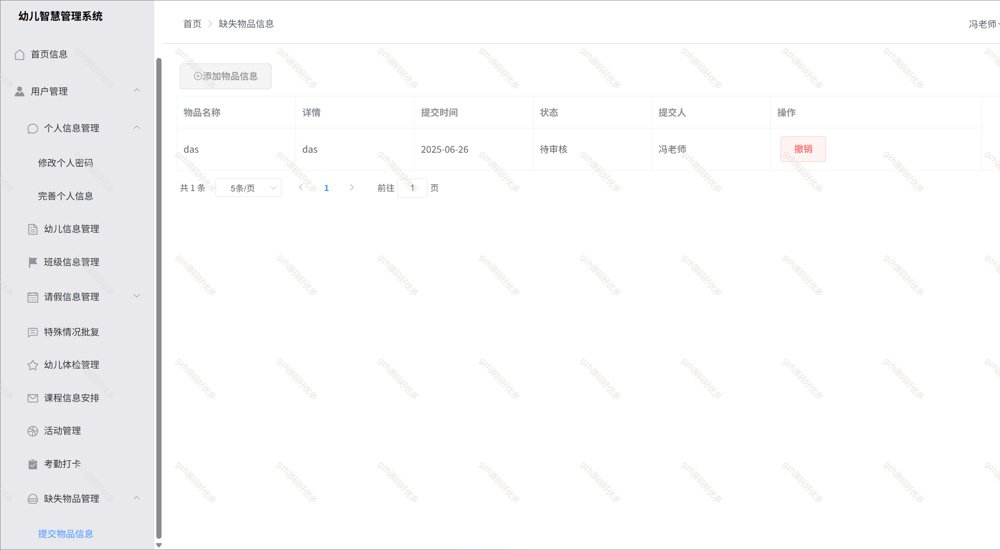
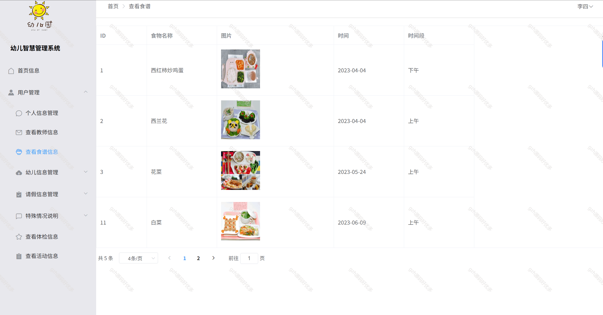
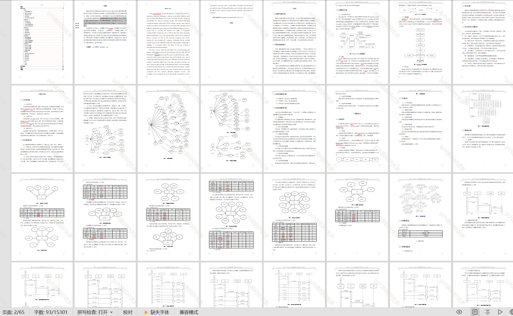

# springbootA396
springbootA396幼儿园管理系统
 
## 查看主页获取源码

### 一、关键词

幼儿园系统，幼儿园管理系统

 

### 二、作品包含

源码+数据库+万字文档+PPPT+全套环境和工具资源+部署教程

 

### 三、项目技术

前端技术： vue2 Element Plus Axios Echarts
后端技术：Java、Mysql、SpringBoot2.0、Mybatis

  

 

### 四、运行环境（以下版本亲测，其他版本未知，请自测）

开发工具：IDEA/eclipse  + VSCODE

数据库：MySQL8

数据库管理工具：Navicat10以上版本

环境配置软件： JDK1.8 + Maven3.6.3

前端Nodejs：16

浏览器：谷歌浏览器

 

### 五、项目介绍

项目编号：springbootA396

该系统能够根据幼儿园的实际需求，将幼儿园的信息化建设与管理工作相结合，不但使管理更精细化，而且降低了管理成本，为幼儿园的可持续发展提供了支持，更为家长和教师之间提供了一个良好的交流平台。

系统共有四种用户:
1.管理员用户:管理用户账号密码，管理职工信息。

2.后勤主任用户:个人信息管理，职工请假审批，考勤登记汇总，制定食谱信息，缺失物品信息管理。

3.教师用户:个人信息管理，幼儿信息管理，提交请假审批，幼儿请假审批，课程信息安排，幼儿活动管理，考勤打卡，提交缺失物品信息，特殊情况批复，班级信息管理，体检信息管理。

4.家长用户:个人信息管理，提交幼儿信息，提交幼儿请假审批，查看教师信息，查看幼儿食谱信息，查看幼儿体检信息等。

 

### 六、运行截图

